# PrimeNet — Full Workflow Reference

PrimeNet is a Flask-based internal web platform for telecom network operations. This document maps the complete system: bootstrap, request lifecycle, authentication, data ingestion, SQLite storage, and every feature blueprint.

**Sources:** `app.py`, `PROJECT_DOCUMENTATION.md`, `modules/sync/scheduler.py`, `pipeline/` orchestrators, and all registered blueprints.

> **Viewing:** Diagrams below are rendered PNG images (also in `docs/primenet_workflow/images/`). Re-run `python scripts/render_workflow_diagrams.py` after editing Mermaid source inside the collapsible sections.

---

## Table of contents

1. [System architecture](#1-system-architecture-everything-at-a-glance)
2. [Application bootstrap](#2-application-bootstrap-startup-order)
3. [HTTP request lifecycle](#3-http-request-lifecycle-every-request)
4. [Authentication, sessions, and roles](#4-authentication-sessions-and-roles)
5. [Data ingestion — complete sync workflow](#5-data-ingestion--complete-sync-workflow)
6. [User journey — login to features](#6-user-journey--login-to-features)
7. [Feature module workflows](#7-feature-module-workflows-every-blueprint)
8. [Database read model](#8-database-read-model)
9. [Operational scripts map](#9-operational-scripts-map-offline--cli)
10. [End-to-end data lifecycle](#10-end-to-end-day-in-the-life-of-data)
11. [Module quick reference](#11-module-quick-reference)

---

## 1. System architecture (everything at a glance)

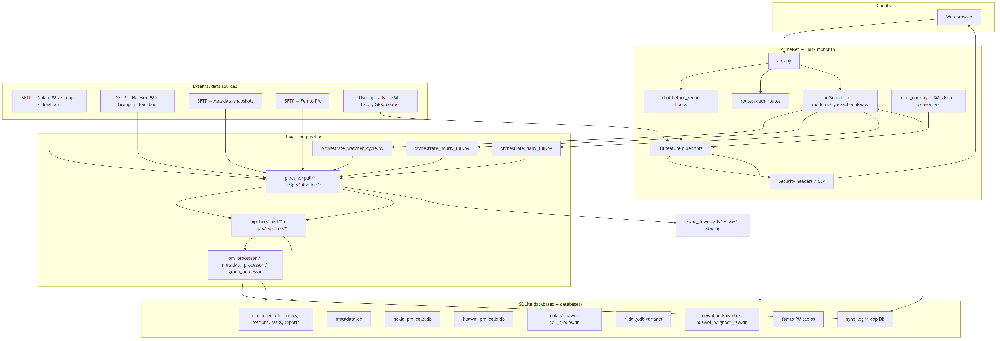

Edit Mermaid source

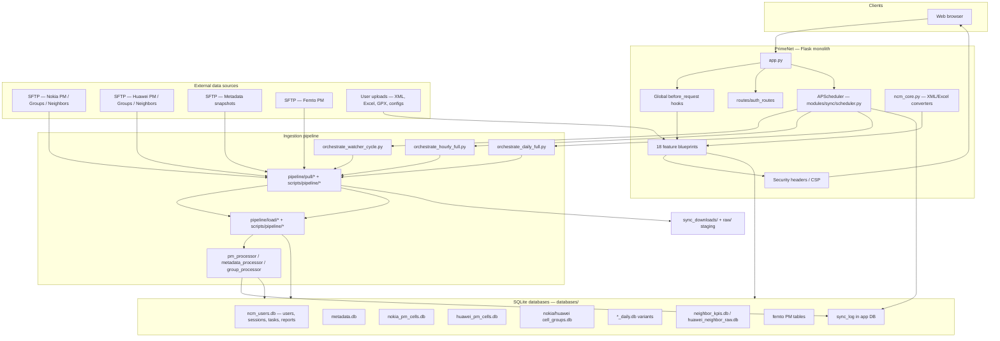
```mermaid
flowchart TB
    subgraph Clients["Clients"]
        Browser["Web browser"]
    end

    subgraph PrimeNet["PrimeNet — Flask monolith"]
        App["app.py"]
        Auth["routes/auth_routes"]
        BeforeReq["Global before_request hooks"]
        AfterReq["Security headers / CSP"]
        Blueprints["18 feature blueprints"]
        Scheduler["APScheduler — modules/sync/scheduler.py"]
        NCMCore["ncm_core.py — XML/Excel converters"]
    end

    subgraph External["External data sources"]
        SFTP_Nokia["SFTP — Nokia PM / Groups / Neighbors"]
        SFTP_Huawei["SFTP — Huawei PM / Groups / Neighbors"]
        SFTP_Meta["SFTP — Metadata snapshots"]
        SFTP_Femto["SFTP — Femto PM"]
        LocalUpload["User uploads — XML, Excel, GPX, configs"]
    end

    subgraph Pipeline["Ingestion pipeline"]
        Watcher["orchestrate_watcher_cycle.py"]
        HourlyOrch["orchestrate_hourly_full.py"]
        DailyOrch["orchestrate_daily_full.py"]
        PullScripts["pipeline/pull/* + scripts/pipeline/*"]
        LoadScripts["pipeline/load/* + scripts/pipeline/*"]
        Processors["pm_processor / metadata_processor / group_processor"]
    end

    subgraph Storage["SQLite databases — databases/"]
        AppDB["ncm_users.db — users, sessions, tasks, reports"]
        MetaDB["metadata.db"]
        NokiaPM["nokia_pm_cells.db"]
        HuaweiPM["huawei_pm_cells.db"]
        GroupsDB["nokia/huawei cell_groups.db"]
        DailyDB["*_daily.db variants"]
        NeighborDB["neighbor_kpis.db / huawei_neighbor_raw.db"]
        FemtoDB["femto PM tables"]
        SyncLog["sync_log in app DB"]
    end

    Browser --> App
    App --> BeforeReq --> Blueprints
    Blueprints --> AfterReq --> Browser
    App --> Auth
    App --> Scheduler

    Scheduler --> Watcher
    Scheduler --> HourlyOrch
    Scheduler --> DailyOrch
    Watcher --> PullScripts
    HourlyOrch --> PullScripts --> LoadScripts
    DailyOrch --> PullScripts --> LoadScripts
    LoadScripts --> Processors

    SFTP_Nokia & SFTP_Huawei & SFTP_Meta & SFTP_Femto --> PullScripts
    PullScripts --> sync_dl["sync_downloads/ + raw/ staging"]
    Processors --> Storage
    LoadScripts --> Storage
    Blueprints --> Storage
    LocalUpload --> Blueprints
    NCMCore --> Blueprints
    Processors --> SyncLog
    Scheduler --> SyncLog
```

---

## 2. Application bootstrap (startup order)

Edit Mermaid source

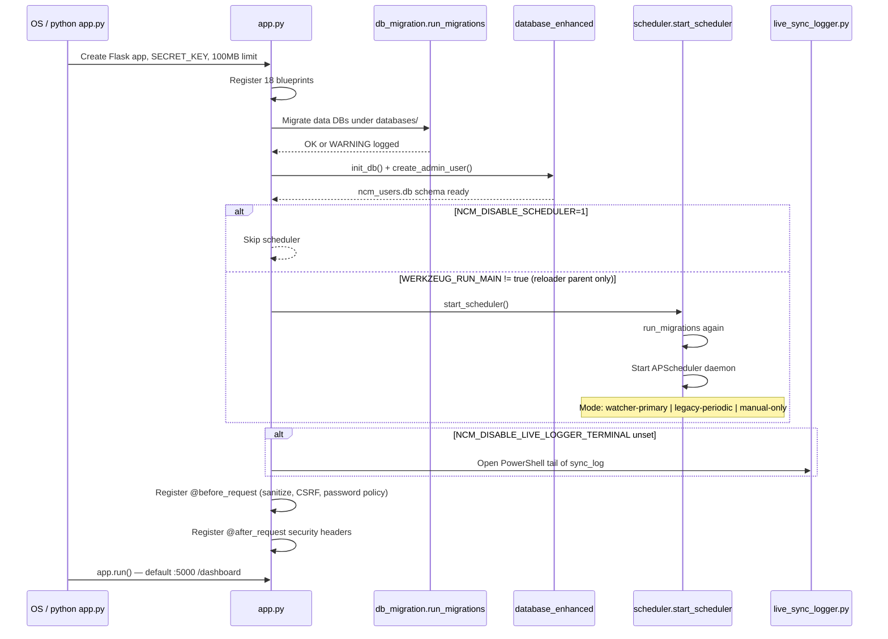
```mermaid
sequenceDiagram
    participant OS as OS / python app.py
    participant App as app.py
    participant Mig as db_migration.run_migrations
    participant DB as database_enhanced
    participant Sched as scheduler.start_scheduler
    participant Term as live_sync_logger.py

    OS->>App: Create Flask app, SECRET_KEY, 100MB limit
    App->>App: Register 18 blueprints
    App->>Mig: Migrate data DBs under databases/
    Mig-->>App: OK or WARNING logged
    App->>DB: init_db() + create_admin_user()
    DB-->>App: ncm_users.db schema ready

    alt NCM_DISABLE_SCHEDULER=1
        App-->>App: Skip scheduler
    else WERKZEUG_RUN_MAIN != true (reloader parent only)
        App->>Sched: start_scheduler()
        Sched->>Sched: run_migrations again
        Sched->>Sched: Start APScheduler daemon
        Note over Sched: Mode: watcher-primary | legacy-periodic | manual-only
    end

    alt NCM_DISABLE_LIVE_LOGGER_TERMINAL unset
        App->>Term: Open PowerShell tail of sync_log
    end

    App->>App: Register @before_request (sanitize, CSRF, password policy)
    App->>App: Register @after_request security headers
    OS->>App: app.run() — default :5000 /dashboard
```

### Scheduler modes

Defined in `modules/sync/scheduler.py`:

| Mode | Condition | Jobs |
|------|-----------|------|
| **watcher-primary** (default) | `NCM_WATCHER_PRIMARY=1`, watcher not disabled | Poll SFTP signatures → pull+load on change |
| **legacy-periodic** | `NCM_ENABLE_LEGACY_PERFORMANCE_SCHEDULER=1` | Hourly full sync + daily cron |
| **manual-only** | Watcher off + legacy off | Admin API triggers only |

### Registered blueprints (`app.py`)

| Blueprint | Package |
|-----------|---------|
| `auth_bp` | `routes/auth_routes` |
| `xml_parser_bp` | `modules/xml_parser` |
| `excel_generator_bp` | `modules/excel_generator` |
| `ne_comparison_bp` | `modules/ne_comparison` |
| `parameter_dictionary_bp` | `modules/parameter_dictionary` |
| `network_map_bp` | `modules/network_map` |
| `admin_panel_bp` | `modules/admin_panel` |
| `sync_bp` | `modules/sync` |
| `performance_bp` | `modules/performance` |
| `config_history_bp` | `modules/config_history` |
| `network_management_bp` | `modules/network_management` |
| `reports_bp` | `modules/reports` |
| `conflict_map_bp` | `modules/conflict_map` |
| `user_profile_bp` | `modules/user_profile` |
| `femto_pm_bp` | `modules/femto_pm` |
| `task_scheduler_bp` | `modules/task_scheduler` |
| `drive_test_viewer_bp` | `modules/drive_test_viewer` |
| `cell_heatmap_bp` | `modules/cell_heatmap` |
| `ran_features_bp` | `modules/ran_features` |

---

## 3. HTTP request lifecycle (every request)

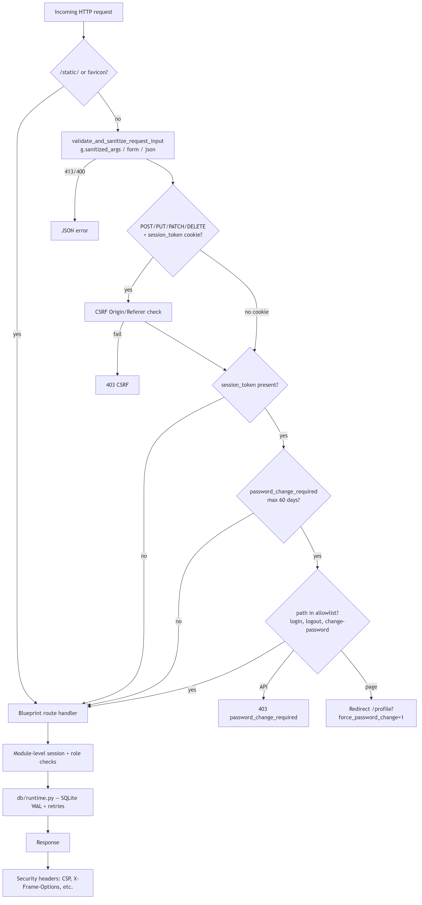

Edit Mermaid source

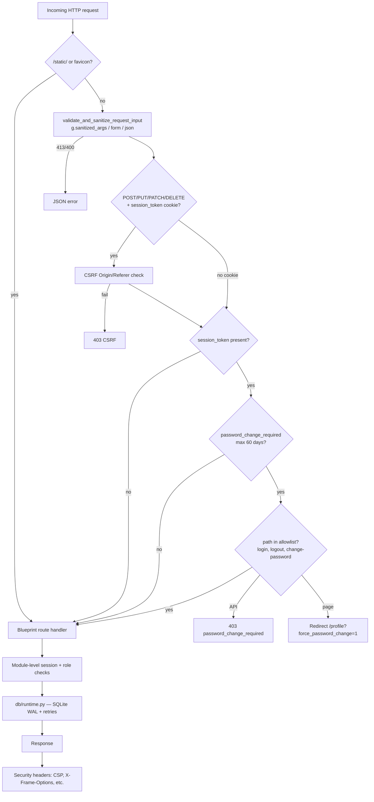
```mermaid
flowchart TD
    REQ["Incoming HTTP request"] --> STATIC{"/static/ or favicon?"}
    STATIC -->|yes| HANDLER["Blueprint route handler"]
    STATIC -->|no| SANITIZE["validate_and_sanitize_request_input<br/>g.sanitized_args / form / json"]

    SANITIZE -->|413/400| ERR1["JSON error"]
    SANITIZE --> CSRF{"POST/PUT/PATCH/DELETE<br/>+ session_token cookie?"}
    CSRF -->|yes| ORIGIN["CSRF Origin/Referer check"]
    ORIGIN -->|fail| ERR2["403 CSRF"]
    ORIGIN --> PW{"session_token present?"}
    CSRF -->|no cookie| PW

    PW -->|no| HANDLER
    PW -->|yes| PWCHECK{"password_change_required<br/>max 60 days?"}
    PWCHECK -->|no| HANDLER
    PWCHECK -->|yes| ALLOW{path in allowlist?<br/>login, logout, change-password}
    ALLOW -->|yes| HANDLER
    ALLOW -->|API| ERR3["403 password_change_required"]
    ALLOW -->|page| REDIR["Redirect /profile?force_password_change=1"]

    HANDLER --> ROLE["Module-level session + role checks"]
    ROLE --> DB["db/runtime.py — SQLite WAL + retries"]
    DB --> RESP["Response"]
    RESP --> HDR["Security headers: CSP, X-Frame-Options, etc."]
```

---

## 4. Authentication, sessions, and roles

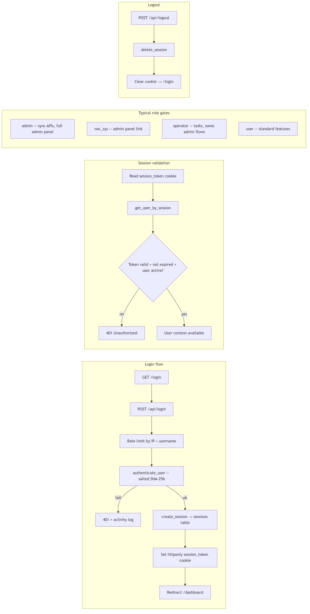

Edit Mermaid source

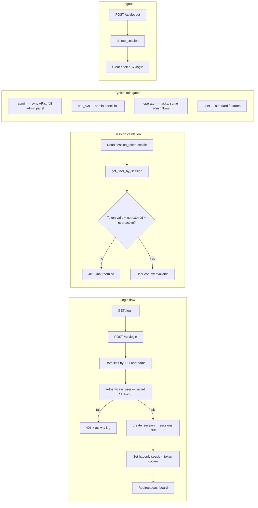
```mermaid
flowchart LR
    subgraph Login["Login flow"]
        L1["GET /login"] --> L2["POST /api/login"]
        L2 --> RL["Rate limit by IP + username"]
        RL --> AUTH["authenticate_user — salted SHA-256"]
        AUTH -->|fail| L403["401 + activity log"]
        AUTH -->|ok| SESS["create_session → sessions table"]
        SESS --> COOKIE["Set httponly session_token cookie"]
        COOKIE --> DASH["Redirect /dashboard"]
    end

    subgraph Session["Session validation"]
        S1["Read session_token cookie"] --> S2["get_user_by_session"]
        S2 --> S3{"Token valid + not expired + user active?"}
        S3 -->|no| S401["401 Unauthorized"]
        S3 -->|yes| SOK["User context available"]
    end

    subgraph Roles["Typical role gates"]
        R1["admin — sync APIs, full admin panel"]
        R2["noc_sys — admin panel link"]
        R3["operator — tasks, some admin flows"]
        R4["user — standard features"]
    end

    subgraph Logout["Logout"]
        O1["POST /api/logout"] --> O2["delete_session"]
        O2 --> O3["Clear cookie → /login"]
    end
```

**Notes:**

- Registration is disabled: `/register` redirects; `/api/register` returns 403.
- Password rotation enforced globally via `enforce_password_rotation` in `app.py` (60-day max).

### App DB tables (`database_enhanced.py`)

| Category | Tables |
|----------|--------|
| User/session/audit | `users`, `sessions`, `activity_log` |
| Tasking | `tasks`, `task_updates` |
| Profiles | `filter_profiles`, `user_preferences` |
| Feature storage | `config_versions`, `report_archive` |
| Config scheduler | `config_scheduler_tasks`, `config_scheduler_task_files`, `config_scheduler_result_files` |
| Sync audit | `sync_log` |

---

## 5. Data ingestion — complete sync workflow

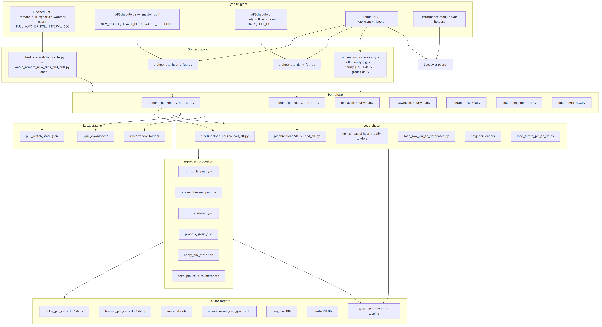

Edit Mermaid source

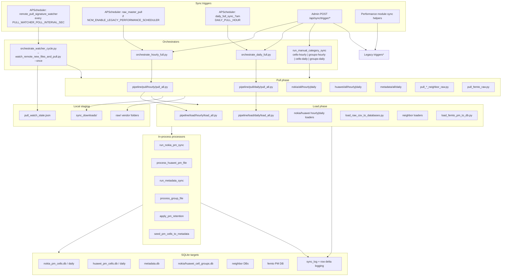
```mermaid
flowchart TB
    subgraph Triggers["Sync triggers"]
        T1["APScheduler: remote_pull_signature_watcher<br/>every PULL_WATCHER_POLL_INTERVAL_SEC"]
        T2["APScheduler: raw_master_pull<br/>if NCM_ENABLE_LEGACY_PERFORMANCE_SCHEDULER"]
        T3["APScheduler: daily_full_sync_7am<br/>DAILY_PULL_HOUR"]
        T4["Admin POST /api/sync/trigger/*"]
        T5["Performance module sync helpers"]
    end

    subgraph Orchestrators["Orchestrators"]
        O_W["orchestrate_watcher_cycle.py<br/>→ watch_remote_new_files_and_pull.py --once"]
        O_H["orchestrate_hourly_full.py"]
        O_D["orchestrate_daily_full.py"]
        O_CAT["run_manual_category_sync<br/>cells-hourly | groups-hourly | cells-daily | groups-daily"]
    end

    subgraph Pull["Pull phase"]
        P_H["pipeline/pull/hourly/pull_all.py"]
        P_D["pipeline/pull/daily/pull_all.py"]
        P_N_H["nokia/all/hourly|daily"]
        P_HW_H["huawei/all/hourly|daily"]
        P_META["metadata/all/daily"]
        P_NEI["pull_*_neighbor_raw.py"]
        P_FEM["pull_femto_raw.py"]
    end

    subgraph Stage["Local staging"]
        SD["sync_downloads/"]
        RAW["raw/ vendor folders"]
        STATE["pull_watch_state.json"]
    end

    subgraph Load["Load phase"]
        L_H["pipeline/load/hourly/load_all.py"]
        L_D["pipeline/load/daily/load_all.py"]
        L_N["nokia/huawei hourly|daily loaders"]
        L_CSV["load_raw_csv_to_databases.py"]
        L_NEI["neighbor loaders"]
        L_FEM["load_femto_pm_to_db.py"]
    end

    subgraph Process["In-process processors"]
        PM_N["run_nokia_pm_sync"]
        PM_H["process_huawei_pm_file"]
        META["run_metadata_sync"]
        GRP["process_group_file"]
        RET["apply_pm_retention"]
        SEED["seed_pm_cells_to_metadata"]
    end

    subgraph Targets["SQLite targets"]
        DB1["nokia_pm_cells.db / daily"]
        DB2["huawei_pm_cells.db / daily"]
        DB3["metadata.db"]
        DB4["nokia/huawei_cell_groups.db"]
        DB5["neighbor DBs"]
        DB6["femto PM DB"]
        LOG["sync_log + row delta logging"]
    end

    T1 --> O_W --> STATE
    T2 --> O_H
    T3 --> O_D
    T4 --> O_H & O_D & O_CAT & Legacy["Legacy triggers*"]
    T5 --> Legacy

    O_W --> Pull
    O_H --> P_H --> L_H
    O_D --> P_D --> L_D
    O_CAT --> Pull --> Load

    Pull --> SD & RAW
    Load --> Process --> Targets
    Load --> LOG
    Process --> LOG
```

**Legacy triggers (reset mode):** `pull_nokia_pm`, `pull_huawei_pm`, `pull_metadata`, and `pull_*_groups` return immediately without SFTP work. Active sync uses orchestrator + pipeline paths.

### Hourly pull chain (`pipeline/pull/hourly/pull_all.py`)

1. Nokia hourly pull (critical — fails cycle on error)
2. Huawei hourly pull (critical)
3. Nokia neighbor pull (non-fatal warning on failure)
4. Huawei neighbor pull (non-fatal warning on failure)

Then loaders normalize CSV/XLSX/ZIP → upsert into PM/group/metadata/neighbor DBs, apply retention, write `sync_log`.

### Sync API surface (admin only)

| Endpoint | Purpose |
|----------|---------|
| `GET /api/sync/status` | Scheduler jobs + last sync per type |
| `GET /api/sync/progress` | Live Nokia/Huawei/metadata progress |
| `GET /api/sync/history` | `sync_log` history |
| `POST /api/sync/trigger/pm` | Trigger PM sync |
| `POST /api/sync/trigger/nokia_pm` | Nokia PM |
| `POST /api/sync/trigger/huawei_pm` | Huawei PM |
| `POST /api/sync/trigger/metadata` | Metadata |
| Category triggers | cells-hourly, groups-hourly, cells-daily, groups-daily |
| `POST /api/sync/import_pm_path` | Import from local path |
| `GET /api/sync/test`, `/inspect_local`, `/latest_downloads` | Diagnostics |

### Environment variables (ingestion)

| Variable | Effect |
|----------|--------|
| `NCM_DISABLE_SCHEDULER=1` | No APScheduler |
| `NCM_ENABLE_LEGACY_PERFORMANCE_SCHEDULER=1` | Hourly + daily periodic full sync |
| `NCM_DISABLE_PULL_WATCHER=1` | Disable signature watcher |
| `NCM_WATCHER_PRIMARY` | Default `1` — watcher is primary mode |
| `PM_SYNC_MODE` | `full` or `incremental` |
| `PM_RETENTION_DAYS`, `FEMTO_RETENTION_DAYS` | Row retention |
| `RAW_PULL_INTERVAL_HOURS`, `DAILY_PULL_HOUR` | Legacy scheduler timing |
| `RAW_LOADER_INCREMENTAL`, `RAW_LOADER_TIME_FILTER` | Loader behavior |
| `PULL_WATCHER_POLL_INTERVAL_SEC` | Watcher poll interval |

### SQLite paths (`sync_config.py`)

| DB | Path pattern |
|----|----------------|
| App/users | `databases/admin/all/all/snapshot/ncm_users.db` |
| Metadata | `databases/metadata/all/all/snapshot/metadata.db` |
| Nokia PM hourly | `databases/cells/nokia/all/hourly/nokia_pm_cells.db` |
| Huawei PM hourly | `databases/cells/huawei/all/hourly/huawei_pm_cells.db` |
| Daily variants | `databases/cells/{vendor}/all/daily/*_daily.db` |
| Groups | `databases/groups/{vendor}/all/hourly|daily/` |
| Neighbors | `databases/neighbors/{vendor}/all/hourly/` |
| Staging | `sync_downloads/`, `raw/` |

---

## 6. User journey — login to features

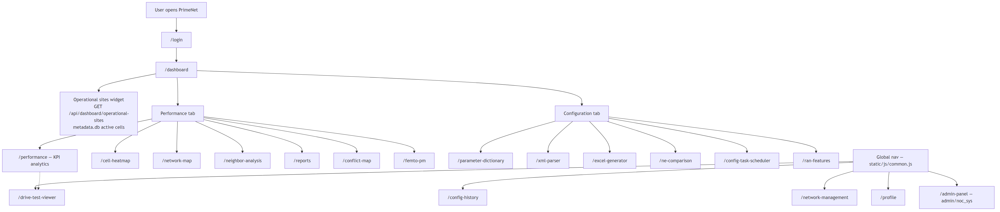

Edit Mermaid source

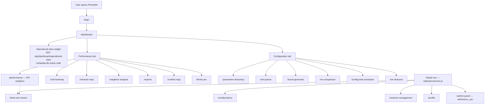
```mermaid
flowchart TB
    START["User opens PrimeNet"] --> LOGIN["/login"]
    LOGIN --> DASH["/dashboard"]

    DASH --> OPS["Operational sites widget<br/>GET /api/dashboard/operational-sites<br/>metadata.db active cells"]

    DASH --> PERF_TAB["Performance tab"]
    DASH --> CONF_TAB["Configuration tab"]

    PERF_TAB --> P1["/performance — KPI analytics"]
    PERF_TAB --> P2["/cell-heatmap"]
    PERF_TAB --> P3["/network-map"]
    PERF_TAB --> P4["/neighbor-analysis"]
    PERF_TAB --> P5["/reports"]
    PERF_TAB --> P6["/conflict-map"]
    PERF_TAB --> P7["/femto-pm"]

    CONF_TAB --> C1["/parameter-dictionary"]
    CONF_TAB --> C2["/xml-parser"]
    CONF_TAB --> C3["/excel-generator"]
    CONF_TAB --> C4["/ne-comparison"]
    CONF_TAB --> C5["/config-task-scheduler"]
    CONF_TAB --> C6["/ran-features"]

    NAV["Global nav — static/js/common.js"] --> C7["/config-history"]
    NAV --> C8["/network-management"]
    NAV --> C9["/drive-test-viewer"]
    NAV --> C10["/profile"]
    NAV --> C11["/admin-panel — admin/noc_sys"]

    P1 -.-> C9
```

---

## 7. Feature module workflows (every blueprint)

### 7.1 Performance & analytics

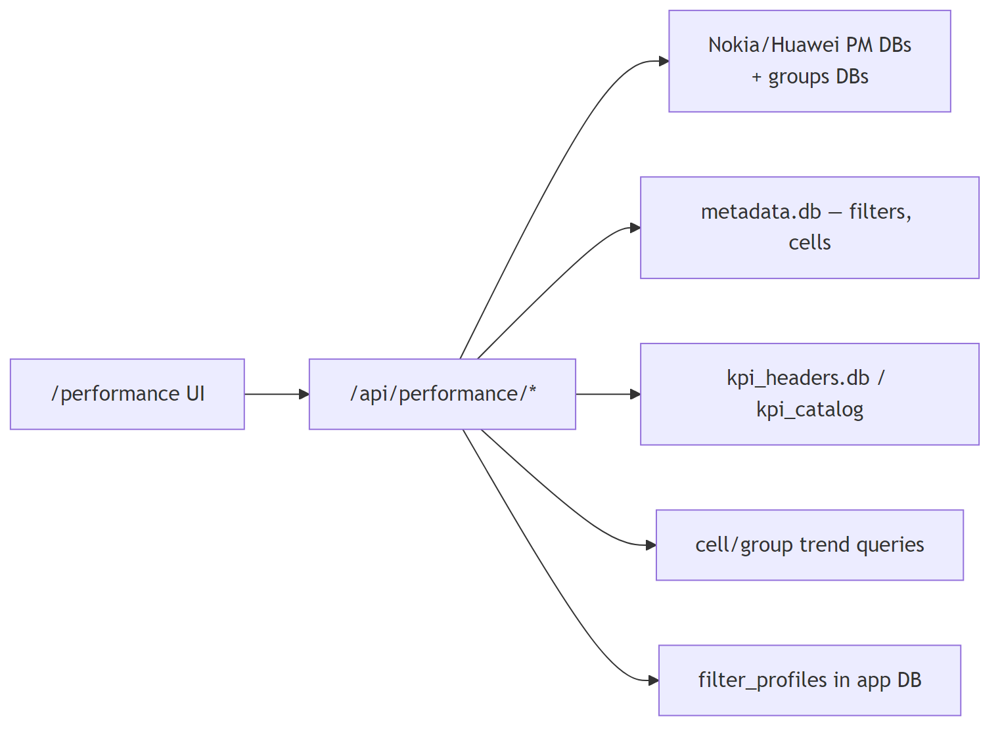

Edit Mermaid source

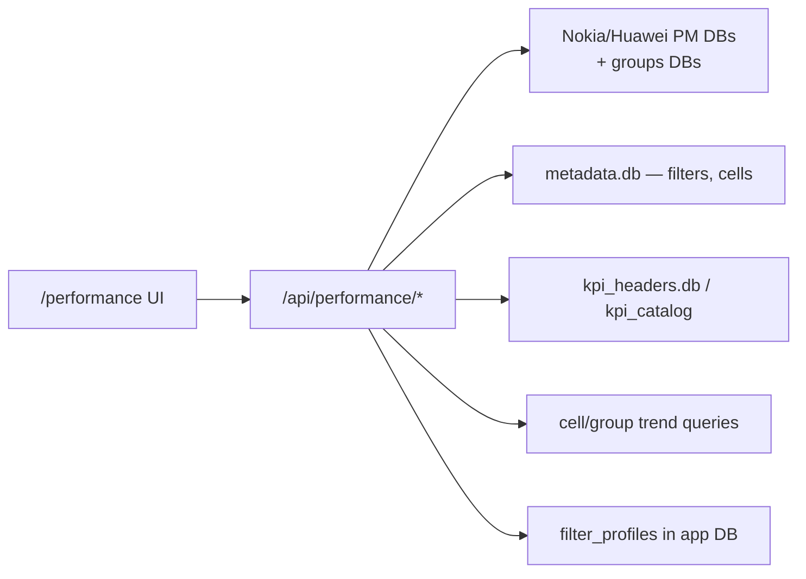
```mermaid
flowchart LR
    UI["/performance UI"] --> API["/api/performance/*"]
    API --> PMDB["Nokia/Huawei PM DBs<br/>+ groups DBs"]
    API --> META["metadata.db — filters, cells"]
    API --> KPI["kpi_headers.db / kpi_catalog"]
    API --> TREND["cell/group trend queries"]
    API --> SAVED["filter_profiles in app DB"]
```

**Key endpoints:** `kpi_columns`, `kpi_mapping`, `groups`, `cell/trend`, `group/trend`, `pm-table`, `reports`, `filters`, `cells`.

### 7.2 Network map & neighbors

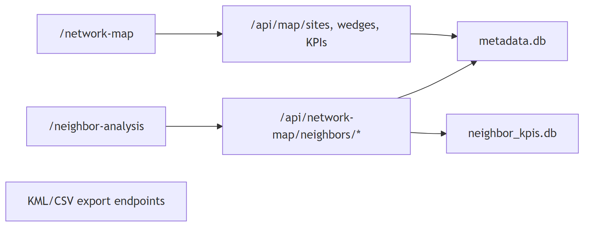

Edit Mermaid source

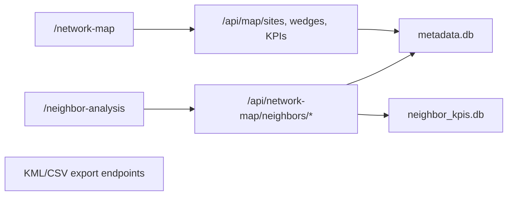
```mermaid
flowchart LR
    MAP["/network-map"] --> SITES["/api/map/sites, wedges, KPIs"]
    NEI["/neighbor-analysis"] --> NL["/api/network-map/neighbors/*"]
    SITES & NL --> META2["metadata.db"]
    NL --> NDB["neighbor_kpis.db"]
    EXP["KML/CSV export endpoints"]
```

### 7.3 Reports

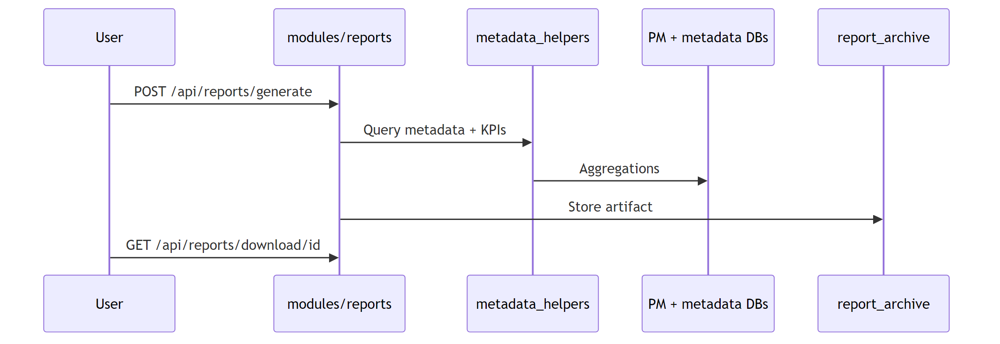

Edit Mermaid source

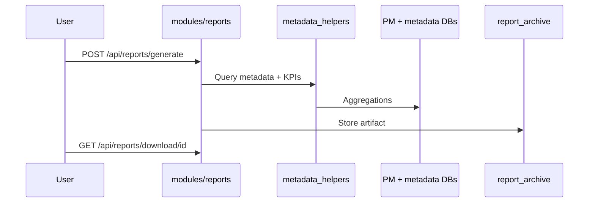
```mermaid
sequenceDiagram
    participant U as User
    participant R as modules/reports
    participant H as metadata_helpers
    participant DB as PM + metadata DBs
    participant A as report_archive

    U->>R: POST /api/reports/generate
    R->>H: Query metadata + KPIs
    H->>DB: Aggregations
    R->>A: Store artifact
    U->>R: GET /api/reports/download/id
```

### 7.4 Configuration tooling (file-based)

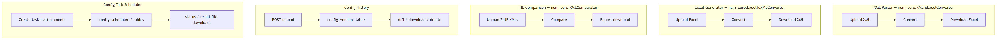

Edit Mermaid source

```mermaid
flowchart TB
    subgraph XML["XML Parser — ncm_core.XMLToExcelConverter"]
        X1["Upload XML"] --> X2["Convert"] --> X3["Download Excel"]
    end
    subgraph XL["Excel Generator — ncm_core.ExcelToXMLConverter"]
        E1["Upload Excel"] --> E2["Convert"] --> E3["Download XML"]
    end
    subgraph NE["NE Comparison — ncm_core.XMLComparator"]
        N1["Upload 2 NE XMLs"] --> N2["Compare"] --> N3["Report download"]
    end
    subgraph CH["Config History"]
        C1["POST upload"] --> C2["config_versions table"]
        C2 --> C3["diff / download / delete"]
    end
    subgraph TS["Config Task Scheduler"]
        T1["Create task + attachments"] --> T2["config_scheduler_* tables"]
        T2 --> T3["status / result file downloads"]
    end
```

### 7.5 Network intelligence

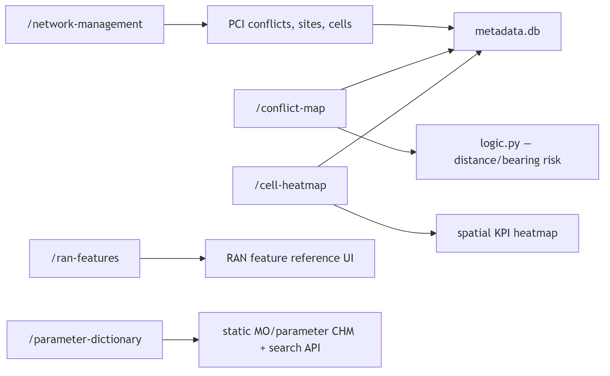

Edit Mermaid source

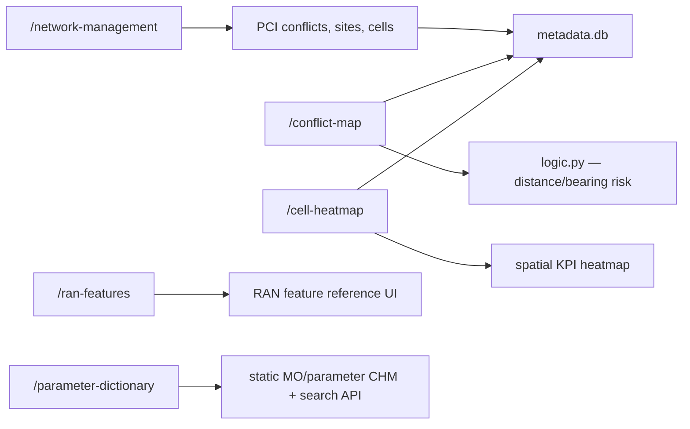
```mermaid
flowchart LR
    NM["/network-management"] --> PCI["PCI conflicts, sites, cells"]
    CM["/conflict-map"] --> LOGIC["logic.py — distance/bearing risk"]
    CHM["/cell-heatmap"] --> HEAT["spatial KPI heatmap"]
    RF["/ran-features"] --> RFAPI["RAN feature reference UI"]
    PD["/parameter-dictionary"] --> CHM2["static MO/parameter CHM + search API"]
    PCI & CM & CHM --> META3["metadata.db"]
```

### 7.6 Femto, drive test, admin, sync

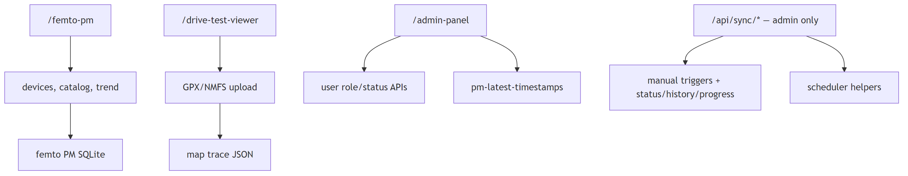

Edit Mermaid source

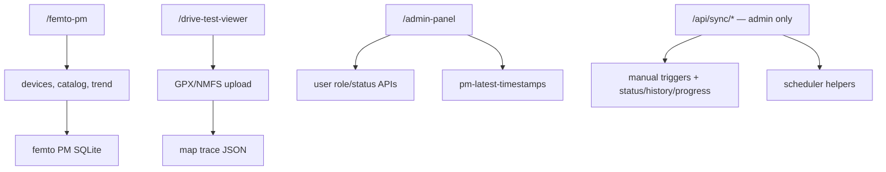
```mermaid
flowchart TB
    FEM["/femto-pm"] --> FAPI["devices, catalog, trend"] --> FDB["femto PM SQLite"]
    DT["/drive-test-viewer"] --> UP["GPX/NMFS upload"] --> TRACE["map trace JSON"]
    ADM["/admin-panel"] --> USR["user role/status APIs"]
    ADM --> PMFRESH["pm-latest-timestamps"]
    SYNC["/api/sync/* — admin only"] --> TRIG["manual triggers + status/history/progress"]
    SYNC --> SCHED2["scheduler helpers"]
```

### 7.7 User profile

| Endpoint | Purpose |
|----------|---------|
| `GET /profile`, `GET /api/profile` | Profile page + data |
| `POST /api/profile/update` | Update profile |
| `POST /api/profile/change-password` | Password change (allowlisted during rotation) |
| `GET/POST /api/profile/preferences` | User preferences |
| `GET /api/profile/activity` | Activity log |
| Photo request workflow | upload request + admin review |

---

## 8. Database read model

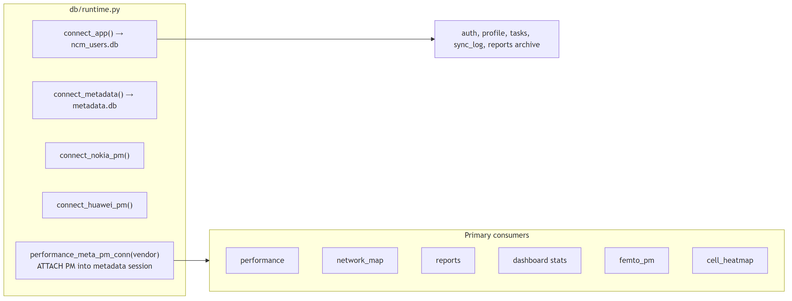

Edit Mermaid source

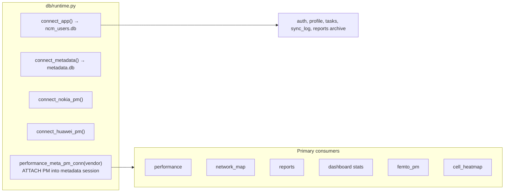
```mermaid
flowchart LR
    subgraph AppLayer["db/runtime.py"]
        CA["connect_app() → ncm_users.db"]
        CM["connect_metadata() → metadata.db"]
        CN["connect_nokia_pm()"]
        CH["connect_huawei_pm()"]
        ATTACH["performance_meta_pm_conn(vendor)<br/>ATTACH PM into metadata session"]
    end

    subgraph Readers["Primary consumers"]
        PERF["performance"]
        NMAP["network_map"]
        REP["reports"]
        DASH2["dashboard stats"]
        FEM2["femto_pm"]
        CHM2["cell_heatmap"]
    end

    ATTACH --> Readers
    CA --> AUTH2["auth, profile, tasks, sync_log, reports archive"]
```

**Resilience patterns:**

- WAL mode + busy timeout + retry on `database is locked`
- Central `sync_log` for pipeline audit
- Startup tolerates migration/init/scheduler failures (warnings only)

---

## 9. Operational scripts map (offline / CLI)

| Category | Scripts |
|----------|---------|
| **Master pull** | `scripts/pull_all_raw.py`, `pull_all_raw_daily.py`, `pull_and_load_daily.py` |
| **Vendor pull** | `pull_nokia_raw*.py`, `pull_huawei_raw*.py`, `pull_metadata_raw.py`, `pull_femto_raw.py` |
| **Neighbors** | `pull_*_neighbor_raw.py`, `load_*_neighbor*.py`, `build_neighbor_kpi_db.py` |
| **Loaders** | `load_raw_csv_to_databases.py`, `load_raw_daily_to_databases.py`, `load_femto_pm_to_db.py` |
| **Schema** | `init_database.py`, `add_new_tables.py`, `modules/sync/db_migration.py` |
| **Diagnostics** | `audit_sqlite_databases.py`, `watch_remote_new_files_and_pull.py`, `live_sync_logger.py` |
| **Pipeline** | `pipeline/orchestrators/orchestrate_*.py`, `pipeline/pull/*`, `pipeline/load/*` |

---

## 10. End-to-end “day in the life” of data

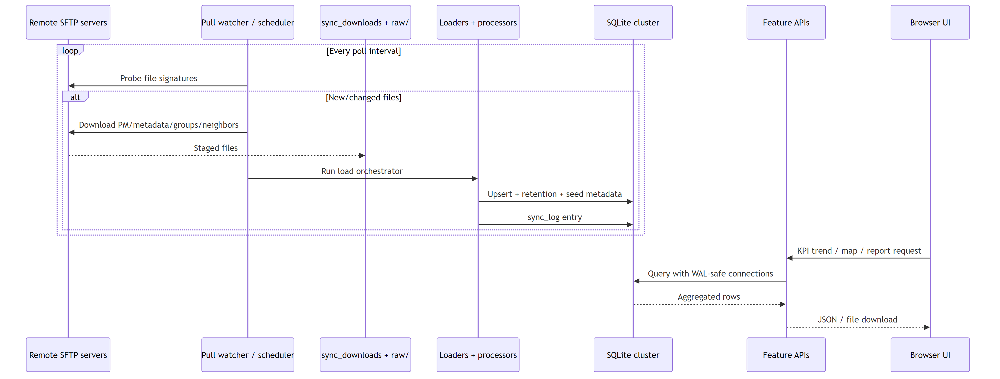

Edit Mermaid source

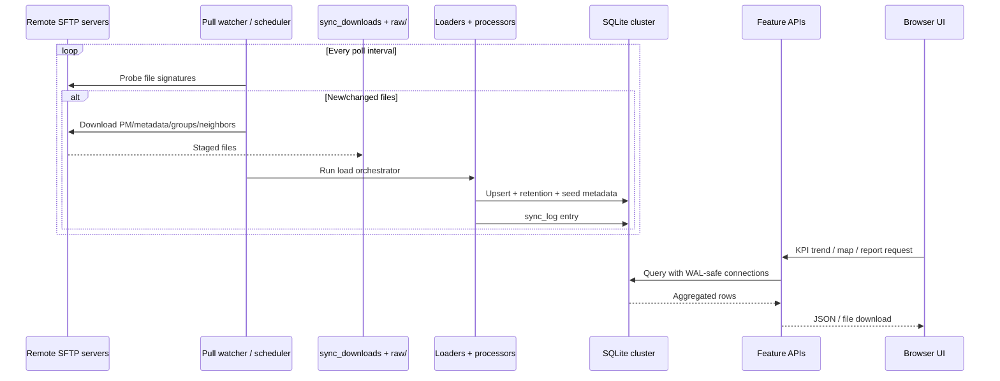
```mermaid
sequenceDiagram
    participant SFTP as Remote SFTP servers
    participant W as Pull watcher / scheduler
    participant Raw as sync_downloads + raw/
    participant L as Loaders + processors
    participant DB as SQLite cluster
    participant API as Feature APIs
    participant UI as Browser UI

    loop Every poll interval
        W->>SFTP: Probe file signatures
        alt New/changed files
            W->>SFTP: Download PM/metadata/groups/neighbors
            SFTP-->>Raw: Staged files
            W->>L: Run load orchestrator
            L->>DB: Upsert + retention + seed metadata
            L->>DB: sync_log entry
        end
    end

    UI->>API: KPI trend / map / report request
    API->>DB: Query with WAL-safe connections
    DB-->>API: Aggregated rows
    API-->>UI: JSON / file download
```

---

## 11. Module quick reference

| Blueprint | Route prefix | Primary data |
|-----------|--------------|--------------|
| auth | `/login`, `/dashboard`, `/api/login` | `ncm_users.db`, `metadata.db` |
| performance | `/performance` | PM + groups DBs |
| network_map | `/network-map`, `/neighbor-analysis` | metadata + neighbors |
| cell_heatmap | `/cell-heatmap` | PM + metadata |
| reports | `/reports` | PM + metadata → `report_archive` |
| conflict_map | `/conflict-map` | metadata |
| femto_pm | `/femto-pm` | femto PM DB |
| network_management | `/network-management` | metadata |
| parameter_dictionary | `/parameter-dictionary` | static CHM/HTML |
| xml_parser | `/xml-parser` | uploads + `ncm_core` |
| excel_generator | `/excel-generator` | uploads + `ncm_core` |
| ne_comparison | `/ne-comparison` | uploads + `ncm_core` |
| config_history | `/config-history` | `config_versions` |
| task_scheduler | `/config-task-scheduler` | scheduler tables |
| user_profile | `/profile` | users, preferences |
| admin_panel | `/admin-panel` | users + PM freshness |
| sync | `/api/sync/*` | triggers pipeline |
| drive_test_viewer | `/drive-test-viewer` | ephemeral uploads |
| ran_features | `/ran-features` | reference content |

---

## Related documentation

| File | Contents |
|------|----------|
| `PROJECT_DOCUMENTATION.md` | Module API lists and architecture notes |
| `FULL_CODEBASE_DEEP_DIVE.md` | Per-file runtime reference |
| `scripts/README.md` | Script usage |

---

## Reading order for new developers

1. `app.py`
2. `routes/auth_routes.py`
3. `database_enhanced.py`
4. `db/runtime.py`
5. `sync_config.py`
6. `modules/sync/routes.py` + `modules/sync/scheduler.py`
7. `pipeline/orchestrators/orchestrate_hourly_full.py`
8. `modules/performance/routes.py`
9. `modules/network_map/routes.py`
10. Remaining `modules/*/routes.py` as needed

---

*Generated workflow reference for PrimeNet — Network Performance & Configuration Platform.*
