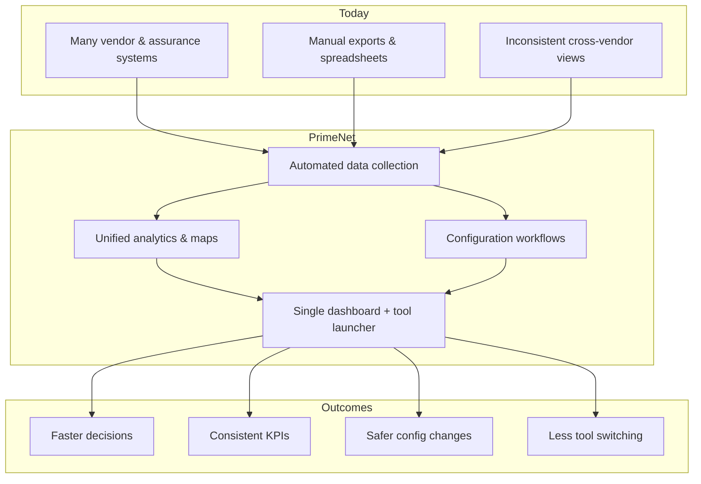
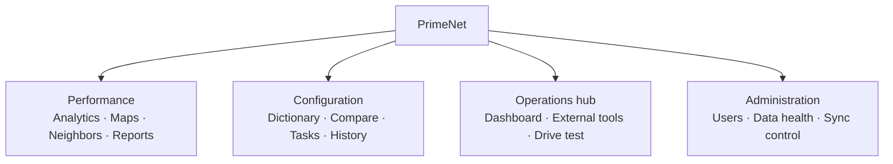
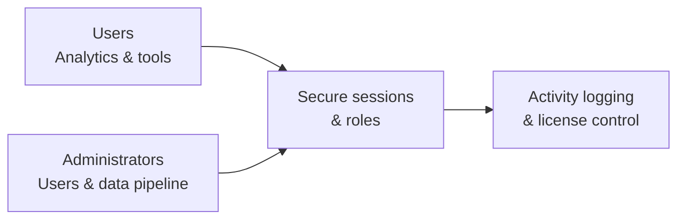
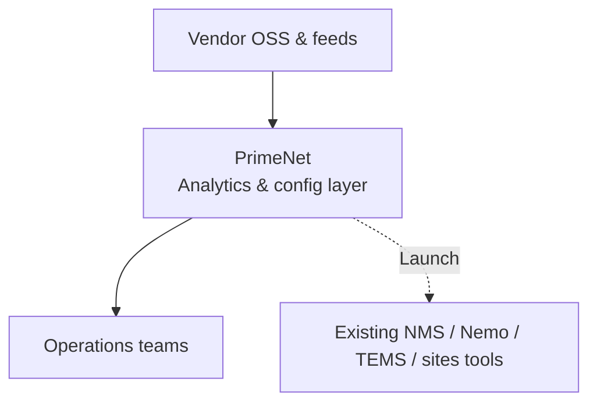

# PrimeNet — Executive Brief

**Radio Network Performance & Configuration Platform**  
*Internal operations platform | Multi-vendor (Nokia, Huawei) | Zain Jordan RAN context*

---

## One-page narrative

### The problem

Radio operations today depend on **many separate systems**: vendor OSS and performance portals, assurance tools, drive-test platforms, site databases, and ad‑hoc spreadsheets. Teams waste time switching contexts, reconciling inconsistent KPI views across vendors, and manually preparing reports. Configuration changes lack a single place to compare files, track tasks, and retain history. Leadership lacks a **unified picture** of operational site counts, performance health, and where the network stands by technology (2G/3G/4G/5G) and vendor.

### The solution

**PrimeNet** is a secure internal web platform that:

1. **Automates collection** of performance, grouping, neighbor, metadata, and small-cell data from vendor feeds on hourly and daily schedules (plus on-demand refresh for administrators).
2. **Stores and serves** that data through one dashboard and a consistent set of analytics, maps, and reporting tools—so engineers see the same KPI definitions and filters regardless of vendor.
3. **Supports configuration discipline** with parameter lookup, file conversion, before/after network-element comparison, scheduled config tasks, and version history.
4. **Acts as an operations hub** by surfacing live operational site metrics and providing one-click access to external OSS, NMS, field-test, and planning tools teams already use.

PrimeNet **complements** vendor OSS—it does not replace it. It reduces friction between “what the network is doing” and “what we need to do about it.”

### Expected value (ROI-oriented)

| Theme | Benefit |
|-------|---------|
| **Time to insight** | Fewer manual exports and spreadsheet merges; KPI trends and maps available in minutes after data lands. |
| **Cross-vendor consistency** | One platform for Nokia and Huawei performance views, neighbor analysis, and reporting templates. |
| **Operational visibility** | Dashboard shows operational sites by RAT and vendor; administrators can monitor data freshness and sync health. |
| **Configuration quality** | Structured compare/convert workflows and task scheduling reduce risk of undetected config drift. |
| **Tool sprawl** | Single sign-on entry point and curated links to PRS, U2020, NetAct, NetChart, Nemo, TEMS, and other daily systems. |
| **Governance** | Role-based access, session security, password policy, activity logging, and licensed deployment controls. |

### Current maturity (honest snapshot)

| Production today | In development | Planned |
|------------------|------------------|---------|
| KPI analytics, network map, neighbor analysis, reports, conflict map, Femto PM | Cell heatmap, SON analytics, network health | RAN features catalog |
| Parameter dictionary, XML/Excel tooling, NE comparison, config task scheduler, config history | | |
| Dashboard, external tools hub, drive-test viewer, network management, tasks | | |

### Investment summary (one line)

PrimeNet turns fragmented RAN operations into a **single, governed workspace** for performance intelligence, configuration support, and daily tool access—improving speed, consistency, and accountability without displacing existing vendor investments.

---

## Three-slide deck outline

Use this structure for a 10–15 minute leadership briefing. Copy speaker notes into presenter view; paste diagrams from [Executive diagrams](#executive-diagrams) or export from [mermaid.live](https://mermaid.live).

---

### Slide 1 — Why we built PrimeNet

**Headline:** One platform for radio performance and configuration operations

**On slide (bullets):**

- Operations rely on **10+ disconnected tools** (OSS, NMS, drive test, sites, spreadsheets).
- **Nokia and Huawei** data live in different places → slow, inconsistent decisions.
- No single view of **operational sites**, KPI health, and config change support.

**Visual:** Problem → solution value chain (Diagram A below)

**Speaker notes:**

- PrimeNet is internal—not a customer-facing product. Audience is NOC, RF engineering, configuration/planning, and management oversight.
- Pain is real: every incident or weekly review currently means logging into multiple systems and manual reconciliation.
- We are not asking to rip out NetAct or U2020; we are consolidating **how our teams work on top of** vendor data.

---

### Slide 2 — What PrimeNet delivers

**Headline:** Three capability pillars

**On slide (three columns):**

| Performance | Configuration | Operations hub |
|-------------|---------------|----------------|
| KPI analytics & trends | Parameter reference | Live site dashboard (by tech & vendor) |
| Network map & neighbors | Config import/export & NE compare | Links to OSS/NMS/field tools |
| Reports, conflict/PCI views | Config tasks & history | Drive tests, inventory, tasks |
| Femto (small cell) monitoring | | Admin: users, data health, sync |

**Visual:** Capability mind map (Diagram B below)

**Speaker notes:**

- **Performance:** day-to-day degradation hunting, neighbor/interference studies, management reports.
- **Configuration:** reduces errors when translating or comparing vendor config files; tasks give traceability.
- **Hub:** dashboard answers “how big is our operational footprint?”; external tools panel saves bookmark chaos.
- Call out **in development** items only if asked—heatmap, SON, network health—so expectations stay clear.

---

### Slide 3 — Outcomes, governance, and next steps

**Headline:** Measurable outcomes and controlled rollout

**On slide (bullets):**

**Outcomes**

- Faster time from vendor data drop to analyst view (automated hourly/daily pipeline).
- Consistent multi-vendor KPI and reporting for leadership reviews.
- Safer configuration workflows and audit trail.

**Governance**

- Role-based access (user → operator → NOC/systems → administrator).
- Session security, password rotation, activity logging, license activation.

**Next steps (suggested)**

1. Endorse PrimeNet as the **standard internal entry point** for RAN performance and config support.
2. Align NOC/admin on **data freshness SLAs** (hourly performance, daily deep sync).
3. Prioritize roadmap: network health dashboard, SON analytics, cell heatmap.

**Visual:** Role/governance strip (Diagram C below) — optional: tool landscape (Diagram D from prior brief)

**Speaker notes:**

- ROI is primarily **labor and decision latency**, not license replacement savings.
- Administrators already monitor PM database health and can trigger sync—important for trust in numbers shown to management.
- Ask for sponsorship on **one front door** policy and training for teams still using legacy spreadsheets.

---

## Executive diagrams

Paste into PowerPoint via Mermaid export, or use in Confluence/GitHub.

### Diagram A — Value chain (Slide 1)

### Diagram B — Three pillars (Slide 2)

### Diagram C — Governance (Slide 3)

### Diagram D — Tool landscape (optional appendix)

---

## Appendix — Q&A cheat sheet

| Question | Short answer |
|----------|----------------|
| Does PrimeNet replace NetAct / U2020? | No. It aggregates performance and config workflows and links out to OSS. |
| Which vendors? | Nokia and Huawei today; metadata and KPIs unified in one UI. |
| How fresh is the data? | Hourly performance updates; daily deep sync; automatic pickup when new vendor files arrive. |
| Who can use it? | Authenticated internal users; admin functions restricted. |
| What’s not ready? | Cell heatmap, SON analytics, network health (in development); RAN features catalog (planned). |
| How is it deployed? | Internal web application with optional license/activation controls for production. |

---

*Document version: June 2026 · For executive and stakeholder briefings*
